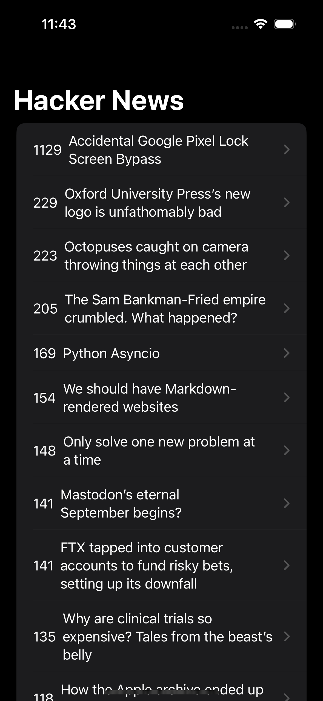
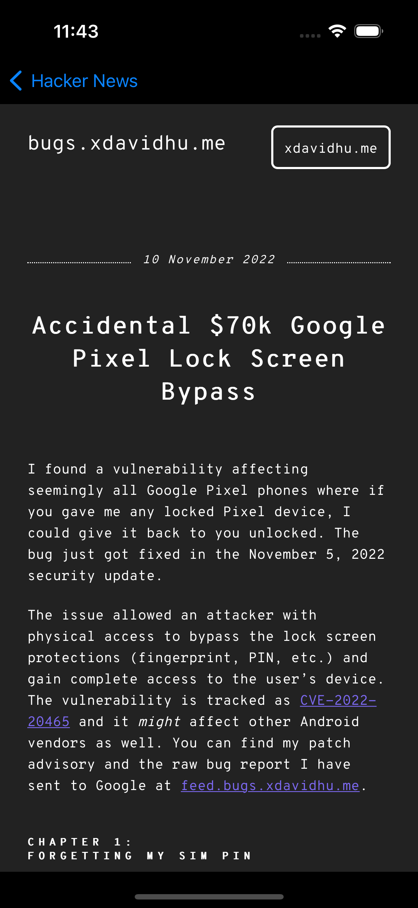
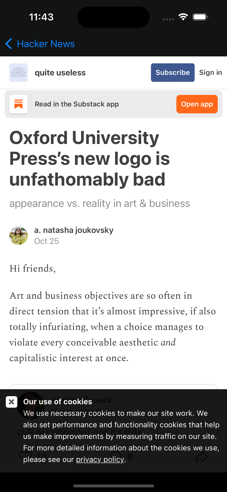

# Hacker News

## Description

SwiftUI application built using Hacker News API key. 

## Main features

* Working with SwiftUI Lists and Identifiable Protocol.
* Using Navigation View to navigate between the List and detail view.
* Advanced State management using the Observer Design Pattern.
* Incorporating a UIKit component into SwiftUI by using WebKit to display web pages.

## Simulator screenshots

  
